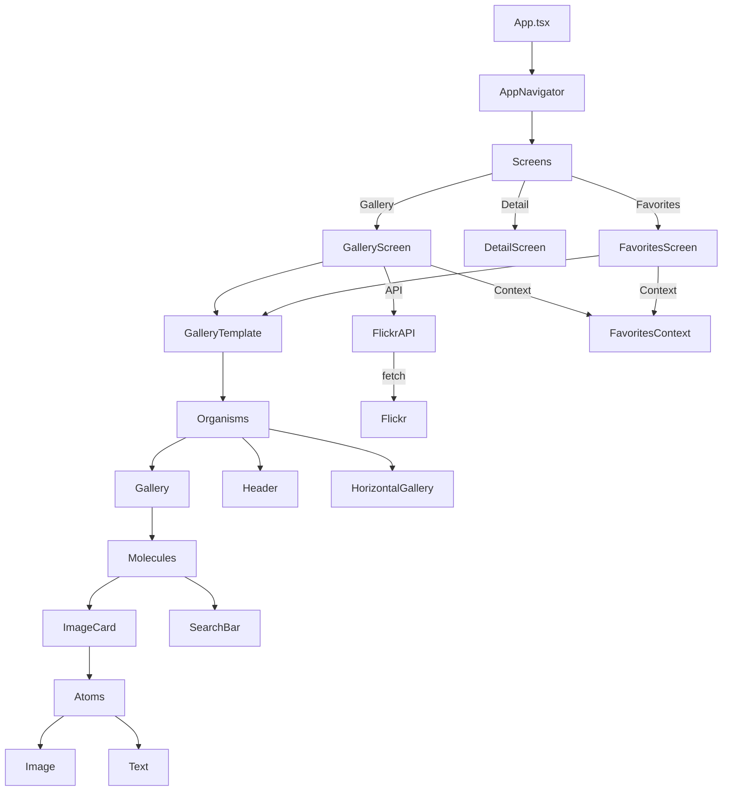

# PutzmeisterGallery Project Overview

## What Has Been Implemented

- **Modern React Native image gallery** using Flickr public feed
- **Atomic design**: Atoms, Molecules, Organisms, Templates
- **Gallery screen**: Fetches and displays images, tag-based filtering, masonry and horizontal layouts
- **Favorites**: Add/remove, persistent with AsyncStorage, Favorites screen with grid view
- **Detail screen**: Image details, share, favorite/unfavorite, dynamic aspect ratio
- **Image caching**: Using `react-native-fast-image`
- **Pull-to-refresh**: On gallery
- **Share functionality**: Native share dialog
- **Error boundaries**: For robust error handling
- **Navigation**: Stack navigation, back/favorites icons
- **Testing**: Jest, React Native Testing Library, unit tests for atoms and molecules
- **TypeScript**: Strong typing throughout
- **Project structure**: Clean, scalable, testable

## Future Improvements

- **Theming**: Light/Dark mode support
- **Accessibility**: Improved accessibility for all components
- **More filter options**: Filter by date, author, etc.
- **Offline support**: Cache images and data for offline use
- **UI/UX polish**: Animations, transitions, better empty states
- **Better error messages**: User-friendly error handling
- **Pagination/infinite scroll**: For large galleries
- **Unit/integration tests**: More coverage, especially for hooks and navigation

## Environment Variable Support

- **Current**: No .env or environment variable support is set up.
- **Recommendation**: Use `react-native-dotenv` or `react-native-config` for API keys, endpoints, and environment-specific settings.

## Network Client Improvements

- **Current**: Fetch API is used directly for network requests.
- **Recommendation**: Use a robust network client like `axios` for better error handling, interceptors, and request/response management. Consider centralizing API logic and adding retry logic, timeouts, and logging.

---

For setup, development, and testing instructions, see the main `README.md`.

